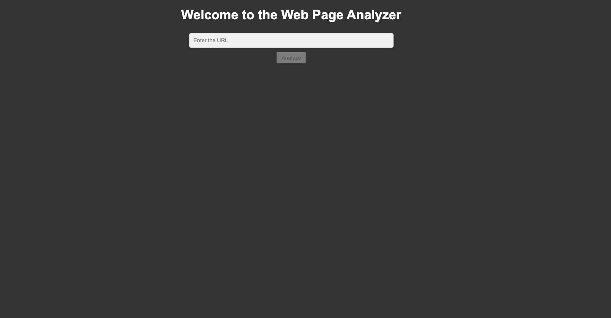
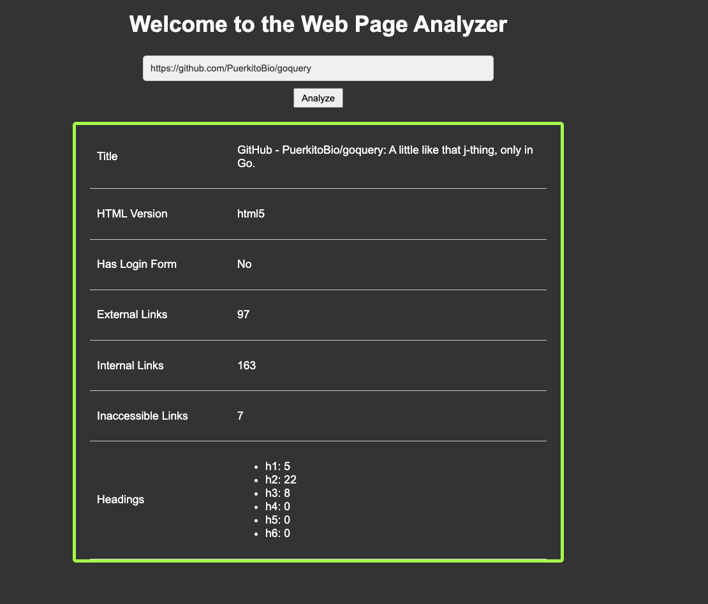

# lt-go-webpage-analyzer

## Overview

This project is a web application that scrapes data from web pages. It accepts a URL as input via a POST request to an API endpoint and extracts information such as:

*   HTML version
*   Page title
*   Headings
*   Internal and external links
*   Inaccessible links
*   Presence of a login form

## Assumptions and Considerations

The following assumptions and considerations were made during development:

*   **HTML Validation:** Goquery does not perform HTML tag validation. It is assumed that the provided URLs will return valid HTML.
*   **Login Form Detection:** Detecting login forms can be complex due to:
    *   CORS restrictions on some pages.
    *   Multi-step login processes (username/password on separate pages).
    *   Login forms injected via JavaScript.
    *   Non-standard form structures.
*   **CORS:** Some pages are protected by CORS, which may result in access being forbidden.

## Architecture

The web application consists of the following key components:

*   **API Endpoint:** Accepts POST requests with a URL to scrape.
*   **Web Scraper:** Uses Goquery to parse the HTML content.
*   **Link Checker:** Identifies internal, external, and inaccessible links.
*   **Data Extraction:** Extracts relevant information from the web page.
*   **Semaphore:** Limits the maximum number of concurrent goroutines to prevent resource exhaustion. The limit can be configured via a constant.

## Local Development

### Prerequisites

*   Go (latest version)
*   Task (taskfile.dev)

### Setup

1.  Install Task:

    ```bash
    go install github.com/go-task/task/v3/cmd/task@latest
    ```

2.  Clone the repository:

    ```bash
    git clone https://github.com/lahirukk01/lt-go-webpage-analyzer.git
    cd lt-go-webpage-analyzer
    ```

3.  Install Go dependencies:

    ```bash
    go mod download
    go mod verify
    ```

### Running the Application

*   **With Hot Reloading (Recommended):**

    ```bash
    task dev -w
    ```

    This command uses Task to build and run the application with hot reloading enabled, so changes to the code will automatically restart the server.

*   **Simple Run:**

    ```bash
    go run cmd/main.go
    ```

    This command directly executes the main file.

### Running with Docker

1.  Build the Docker image:

    ```bash
    docker build -t lt-app .
    ```

2.  Run the Docker container:

    ```bash
    docker run -p 3000:3000 lt-app
    ```

## API Endpoints

### POST /analyze

Accepts a URL as input and returns the extracted web page data.

**Request Body:**

```json
{
  "url": "https://example.com"
}
```

**Response Body:**

```json
{
  "htmlVersion": "html5",
  "title": "Example Domain",
  "headings": {
    "h1": 1,
    "h2": 2
  },
  "internalLinks": 10,
  "externalLinks": 5,
  "inaccessibleLinks": 2,
  "hasLoginForm": true
}
```

## Testing

Unit tests have been implemented for core functionality. Files such as routes, middleware, and main, which primarily contain Fiber framework setup code, have been excluded from unit testing.

## CI/CD

A GitHub Actions workflow is configured to automatically:

*   Run linters
*   Execute unit tests
*   Build Docker images

upon pull request creation or merging into the `main` branch.

## Screenshots

### Landing Page



### Results


## Future Improvements

*   **Login Form:** Implement a login form to restrict user access to the application.
*   **Link Validation:** Enhance link validation to handle more complex scenarios.
*   **HTML Tag Validation:** Implement HTML tag validation to ensure the quality of scraped data.
*   **SPA Support:** Improve support for Single Page Applications (SPAs) by using a headless browser to render the page and extract content.

